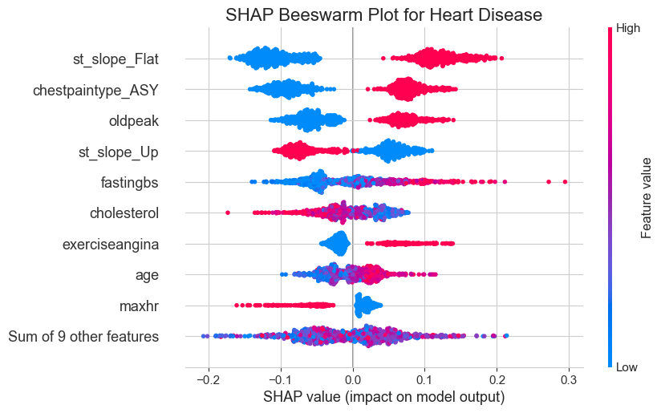

# 🫀 Heart Failure Prediction with Machine Learning

## Overview
This project explores the application of **supervised machine learning** techniques to predict the likelihood of heart disease in patients based on clinical and demographic data. The primary objective is to develop a reliable binary classification model that can assist in early diagnosis, thereby supporting personalized treatment plans and optimizing healthcare resources.

## Objectives

- **Predictive Modeling**: Classify patients as at risk or not at risk of heart disease using various machine learning algorithms.

- **Model Evaluation**: Assess models based on accuracy, interpretability, scalability, and generalization to new data.

- **Feature Analysis**: Utilize explainability tools to understand the impact of different features on model predictions.

- The ultimate goal is to enhance early detection, personalized treatment, and resource optimization in healthcare.

## 🔍 Methodology
1. **Data Preprocessing**:
   - Handled missing values and outliers.
   - Standardized features using `StandardScaler`.
   - Addressed class imbalance with `SMOTE` to generate synthetic samples for the minority class.
2. **Model Development**:
   - Built pipelines integrating preprocessing steps and classifiers.
   - Evaluated multiple models: Logistic Regression, Decision Tree, Random Forest, Support Vector Machine (SVM), and XGBoost.
3. **Model Evaluation**:
   - Used cross-validation to assess model performance.
   - Plotted ROC-AUC curves to compare classifiers.
   - Performed hyperparameter tuning for SVM and Random Forest.
4. **Model Selection**:
   - Random Forest and SVM showed the best performance.
   - Random Forest achieved the highest AUC, indicating superior classification capability.
5. **Model Tuning**:
   - Fine-tune hyperparameters using GridSearchCV for better model performance.
6. **Model Explainability**:
   - Applied SHAP to interpret feature importance.
   - Identified key predictors: `st_slope_Flat`, `chestpaintype_ASY`, `oldpeak`, and the absence of `st_slope_Up`.

## 📈 Results

- **Best Model**: Random Forest Classifier

- **Performance Metrics**:

   - **Accuracy**: Achieved 91% accuracy in classifying patients.

   - **AUC Score**: Random Forest had the highest Area Under the Curve, indicating excellent model performance.

- **Feature Importance**:

   - SHAP analysis revealed that `st_slope_Flat`, `chestpaintype_ASY`, and `oldpeak` significantly contribute to the prediction of heart disease.

  

## Conclusion

This project demonstrates the effectiveness of machine learning in early detection of heart disease, which could aid in personalized treatment plans and resource allocation in healthcare. While Random Forest performed the best in this case, SHAP could offer deeper insights into patient risk factors.

Overall, this approach has the potential to enhance early detection, reduce healthcare costs, and improve patient outcomes by identifying at-risk individuals more effectively. 

## Additional content
- [Presentation](https://docs.google.com/presentation/d/11iYIil5NDXSlMP2Q6uov4dAgefgMNFpu184u43WceIE/edit?usp=sharing)
- [Dataset Details](./datasets/dataset.md)
- [Developer setup](./docs/setup.md)
